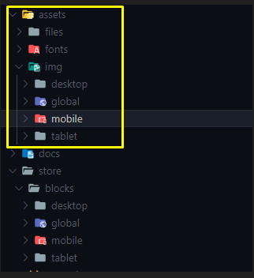
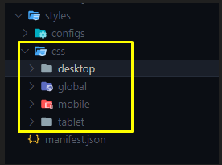

[[It Globers]]

## Structure Foldres

Tener un ordenamiento simetrico y constante nos ayuda a mantener proyectos limpios y escalables, sobre todo a que otras personas lo puedan entender en custion de un par de horas.

Por lo cual tenemos que pensar en los project VTEX IO como un organismo que no muta si no se extiende como las clases en POO.
Para ello debemos pensar en la construcción del esquema de los folders con 4 puntos de partida

1- Desktop
2- Mobile
3- Tablet
4- Global

Porque desde estos cuatro puntos de partida? Bueno porque son las vistas generales en que el cliente ve nuestro producto, Global seria para los file que no se modifican según su vista.


#### Estructura interna de cada carpeta.

Para las folders nombradas (Desktop, Mobile, Tablet y Global), se organizan de manera interna en 2 sub-Folders:

Desktop
=> Components: Contendra todos los componentes que pueda requerir la vista.
=> screen: Contiene los componentes principales que conforman páginas o la página en si misma.

En el foldres componentes cada file debe ir con el nombre de su elemento padre, como se ve en la imagen `header-menu.jsonc` es el componente hijo de `header` asi podemos relacionar un componente con el su children.


## NOTA:

Esta misma estructura se extiende para los folders de CSS y ASSETS.

#### Assets



- Para los folders `files` y `fonts` no se requiere crear la estructura de las carpetas por vista ya contiene files unicos del proyecto y que sirven a todas las vistas. Pero sin cerrarse a que pueda existir esa discriminación por vista.
- Folder `img` aplica para la estructuración de los 4 folders ya que hay imágenes diferentes en cada vista o de tamaños diferentes que deben mostrarse según sea la vista. El nombramiento de cada imagen se llevará de la misma manera que los de componentes padres a hijos, ejemplo:

`header-logo-marca.png`

`header-icon-cart.png` etc.



#### Hay dos "Principios o estándares" Para iniciar un proyecto:

a- Mobile first  
b- Desktop first

En ITGlobers si es un project responsive iniciamos con Mobile first, por qué? porque +70% del trafico en internet se hace desde un dispositivo mobile.

## Nombre a los files and class.css de los proyecto with BEM

`Block-element-modifier`
Por qué hacerlo con BEM?
Bueno BEM es una metodología usada en las hojas de styles para manejar mucho mejor la especificidad, lo cual aprovecharemos en IT Globers para nombrar componentes de VTEX IO y evitar que se repitan nombres o se pisen, igualmente para los file además de su uso en el CSS.

#### Nombrando bloques

Bloques de VTEX IO como `header-row`, `flex-layout.row`, `flex-layout.row`, `store.coustom`, `store.home` etc. Son nombres nativos en VTEX IO y les podemos agregar alias poniendo después de nombre por defecto un #, `flex-layout.row#{alias}`

Y aquí es donde pondremos en uso la metodología BEM para el nombramiento del alias.
Primero nombramos la vista (desktop, mobile, tablet o global) seguido de "\_\_" nombre del component.

Si el el bloque es un children vamos a manejar su nombre:

primero nombramos la vista `flex-layout.row#desktop` seguido de ' ** ' nombre del elemento padre `flex-layout.row#desktop**header`y por ultimo el del componente hijo que estás creando`flex-layout.row#desktop\_\_header--contact`

- para cuando el componente esta en las 3 vistas, mobile, dekstop, tablet usamos "global"

```json
 "header-row#desktop__container-header": {
	 "children": [
		 "flex-layout.row#desktop__header--contact",
		 "flex-layout.row#global__header--menu"
	 ]
 },
```

Que pasa tiene muchos componentes anidados, para el 3er nivel de anidamiento se toma ya el elemento padre como principal y no la vista, ejemplo:

`flex-layout.row#desktop__header--contact` y este elemento tiene un children, seria asi:

```json
 "flex-layout.row#desktop__header--contact": {
	 "children": [
		 "ritch-text#header__contact--title",
		 "Image#header__contact--logo"
	 ]
 },
```

#### Nombrando clases

Con las clases en los bloques es más práctico porque simple mente es ponerle el mismo alias del bloque como class en el css.

```json
 "header-row#desktop__container-header": {
	 "children": [
		 "flex-layout.row#desktop__header--contact",
		 "flex-layout.row#global__header--menu"
	 ],
	 "props": {
		 "blockClass": "desktop__container-header",
		 "fullWidth": "true"
	 }
 },
```

Tambien tener en cuenta que en algunos proyectos es necesario reutilizar componentes con unas pequeñas variaciones en los styles, lo cual podemos hacer uso del array de classes que se puede manejar en Vtex.

```json
 "header-row#desktop__container-header": {
	 "children": [
		 "flex-layout.row#desktop__header--contact",
		 "flex-layout.row#global__header--menu"
	 ],
	 "props": {
		 "blockClass": [
			 "desktop__container-header",
			 "Variante__uno",
			 "variante__dos"
			],
		 "fullWidth": "true"
	 }
 },
```

#### Nombrando files

El nombramiento de los file `.jsonc` es de igual manera simple y práctico, si hablamos de un bloque principal como `'header', 'footer', 'home', 'product-page'` etc. El nombre del file solo llevará el mismo nombre con la extensión 'header.jsonc', `'footer.jsonc', 'home.jsonc', 'product-page.jsonc'`, Si el file es un componente hijo como:

`header.jsonc` tiene un componente hijo que es el `menu`entonces el file del menú se llamara `header-menu.jsonc`.

### Variables en los file.css

En la carpeta Global de css podemos crear un file de nombre `vtex.flex-layout.css` y poner en el la variables de colores

```css
.flexRow,
:global(.vtex-minicart-2-x-drawer),
:global(.vtex-store__template),
:global(.vtex-store-drawer-0-x-drawer),
:global(.vtex-minicart-2-x-portalContainer) {
  --emphasis: #df0209;
  --action-primary: #ff9700;
  --color-TC-cencosud: #e88613;
  --color-TC-codensa: #358fd4;
  --color-TC-aval: #1234b5;
  --color-TC-itau: #100c73;
  --action-secondary: #ff9700;
  --muted-1: #1a1a1a;
  --muted-1-5: #2f2f2f;
  --muted-1-8: #6b6b6b;
  --muted-2: #afafaf;
  --muted-3: #cacbcc;
  --muted-4: #e3e4e6;
  --muted-5: #f2f4f5;
  --white: #fff;
  --yellowMetro: #ffed00;
  --greenTelefonos: #289e36;
  --greenOfertas: #7ac537;
  --puntosCenco: #843a8d;
  --titlesValores-page: #c47373;
  --ParrafosValores-page: #525252;
}
```

## RFC y ADR

#### RFC

- Name del proyecto
- Tecnologias/componentes a usar y por qué.
- Con una descripcion detallada del componente y la forma de implementarlo.

Ejemplo:
`Header`: se usara un `header-row` como contenedor general del header y ya cada sub-header sera con un `flex-layout.row` etc... Porque de esta manera sera mas practico al momento de darle styles etc...

#### ADR

Realizado por el lider tecnico despues de tener claro el RFC, documento donde reposara todo el work flow de proyecto con los requerimientos o historias de usurario, seran los insumos para alimentar el Jira.

- Definir si los commit, PR, merge, documentacion etc... definir el idioma desde el inicio, Ingles, español.

## Commits, Pull Request and Merge

#### Estandar en los commits <a href="https://gist.github.com/joshbuchea/6f47e86d2510bce28f8e7f42ae84c716">DOCS</a>

```json
	<type>(<scope>): <subject> <-- description -->

example:
		   <feat>(<header>): <create header with drop-down menu > <-- add drop-down menu for categories wite redirect -->
```

#### Pull request => que muestres que brach es la que entra y a cual elemplo:

```json

example:

**##feat<header-USA#342>:** create header with drop-down menu
|--> **description:**<!--add drop-down menu for categories with redirect.-->
|--> **How to test it?:** <!--- Don't forget to add a link to a Workspace where this branch is linked -->[Workspace](Link goes here!)
|--> **How does this PR make you feel?:**[:eslabón:](https://a.slack-edge.com/production-standard-emoji-assets/13.0/google-medium/1f517.png)****](**[http://giphy.com/](http://giphy.com/)**)
|--> **#### Screenshots or example usage:**<!--- Add some images or gifs to showcase changes in behaviour or layout. Example: before and after images, use only browser of GitHub-->
|--> **Does it depend on another component?:** <!---if depent of any apps-->								 |--> **url-custom-apps:** <!---link a apps donde los proyectos necesiten de ellas para	funcionar.-->
|--> **name-element-additional:** <!--mensaje-elemento-adicional
```

#### Merge

- Antes de cualquier merge el PR debe tener como minimo X reviciones.
- Quien hara los Merge en cada proyecto.

## Jira

Crear una epica con nombre de ADR donde se trae el rfc para el analisis de los requisitos del proyecto.

// blockClass en arrays, para reutilizar los styles
